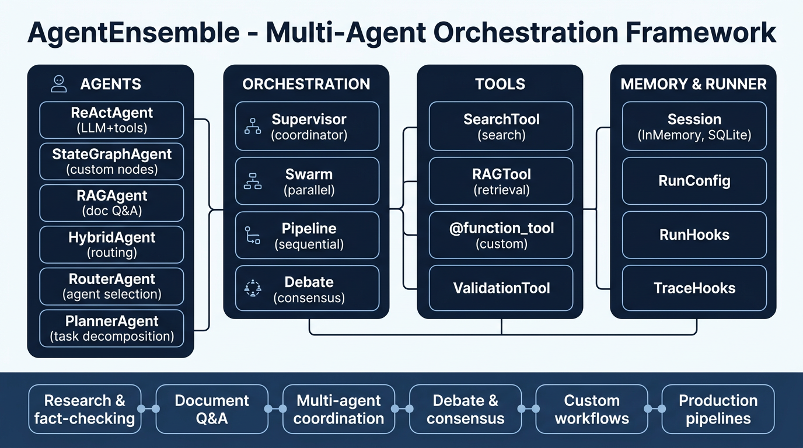

# AgentEnsemble

**Production-ready multi-agent orchestration for Python**

AgentEnsemble is a modern framework for building and orchestrating AI agent systems. Designed for clarity, extensibility, and production use—comparable to LangGraph, CrewAI, and AutoGen.

[](https://www.python.org/downloads/)
[](LICENSE)
[](https://pypi.org/project/agentensemble/)
[](https://pepy.tech/projects/agentensemble)

---

## Design Philosophy

- **Modular** — Agents, tools, orchestration, and memory are decoupled
- **Async-first** — `run()` and `arun()` on all agents; parallel execution via `asyncio.gather`
- **Provider-agnostic** — LLM interface supports Mistral (OpenAI/Anthropic-ready)
- **Production patterns** — Runner, retries, hooks, tracing, session memory

---

## Architecture

<p align="center">
  
</p>

*Architecture, functionalities, and use cases — what AgentEnsemble is capable of.*

```
┌─────────────────────────────────────────────────────────────────┐
│                        AgentEnsemble                             │
├─────────────┬─────────────┬─────────────┬───────────────────────┤
│   Agents    │ Orchestration│   Tools     │ Memory & Runner       │
├─────────────┼─────────────┼─────────────┼───────────────────────┤
│ ReActAgent  │ Ensemble    │ SearchTool  │ Session (InMemory,    │
│ StateGraph  │ Supervisor  │ RAGTool     │ SQLite)               │
│ RAGAgent    │ Swarm       │ @function_  │ Runner + RunConfig    │
│ HybridAgent │ Pipeline    │ tool        │ TraceHooks            │
│ RouterAgent │ Debate      │ Validation  │                       │
│ PlannerAgent│             │             │                       │
└─────────────┴─────────────┴─────────────┴───────────────────────┘
```

---

## Quick Start

```bash
pip install agentensemble
# Optional: pip install agentensemble[search,rag]
```

```python
from agentensemble import ReActAgent, SearchTool, Runner

agent = ReActAgent(name="research", tools=[SearchTool()], max_iterations=5)
result = Runner.run(agent, "What are the latest AI breakthroughs in 2024?")
print(result["result"])
```

**Setup:** Copy `.env.example` to `.env` and add your keys. Use `KEY=value` format (no spaces around `=`).

---

## Examples — Code + Output

Each example is runnable. Requires `.env` with `MISTRAL_API_KEY` and `SERPER_API_KEY` (see `.env.example` for format).

---

### 1. ReActAgent — LLM decides when to search

```python
from agentensemble import ReActAgent, SearchTool

agent = ReActAgent(name="research", tools=[SearchTool()], max_iterations=5)
result = agent.run("Who won the 2024 Nobel Prize in Physics?")
print(result["result"])
```

**Output:**

```
The 2024 Nobel Prize in Physics was awarded jointly to John J. Hopfield and
Geoffrey E. Hinton for their foundational discoveries and inventions that
enable machine learning with artificial neural networks.
```

---

### 2. Custom @function_tool — Add your own tools

```python
from agentensemble import ReActAgent, SearchTool, function_tool

@function_tool(description="Get current weather for a city")
def get_weather(city: str) -> str:
    return f"Weather in {city}: 72°F, partly cloudy"

agent = ReActAgent(tools=[SearchTool(), get_weather], max_iterations=4)
result = agent.run("What is the weather in Paris?")
print(result["result"])
```

**Output:**

```
The current weather in Paris is 72°F (22°C) with partly cloudy conditions.
```

---

### 3. HybridAgent — LLM routes SEARCH → RAG → VALIDATE → ANSWER

```python
from agentensemble import HybridAgent, SearchTool

agent = HybridAgent(tools=[SearchTool()], max_iterations=5)
result = agent.run("What are the key trends in AI agents in 2024?")
print(result["result"][:300], "...")
print("Actions:", result["metadata"]["actions_taken"])
```

**Output:**

```
1. Multi-Modal AI Models Redefined Possibilities · 2. AI Agents Stepping Into
the Spotlight · 3. AI's Bold Move into Video Creation · 4. Rise of Open-Source AI...
Actions: ['SEARCH', 'SEARCH', 'RAG', 'VALIDATE', 'ANSWER']
```

---

### 4. Swarm — Parallel agents (multiple perspectives)

```python
from agentensemble import ReActAgent, SwarmOrchestrator, SearchTool

researcher = ReActAgent(name="researcher", tools=[SearchTool()], max_iterations=2)
fact_checker = ReActAgent(name="fact_checker", tools=[SearchTool()], max_iterations=2)

swarm = SwarmOrchestrator(agents={"researcher": researcher, "fact_checker": fact_checker})
result = swarm.perform("What is the capital of France?")
for name, r in result["results"].items():
    print(f"{name}: {r['result'][:80]}...")
```

**Output:**

```
researcher: The capital of France is Paris.
fact_checker: The capital of France is Paris.
```

---

### 5. Pipeline — Sequential (search → summarize)

```python
from agentensemble import ReActAgent, PipelineOrchestrator, SearchTool

searcher = ReActAgent(name="searcher", tools=[SearchTool()], max_iterations=2)
summarizer = ReActAgent(name="summarizer", tools=[], max_iterations=1)

pipeline = PipelineOrchestrator(agents={"searcher": searcher, "summarizer": summarizer})
result = pipeline.perform("Summarize the top 3 AI breakthroughs in 2024")
print(result["final_result"]["previous_result"][:250], "...")
```

**Output:**

```
1. Multimodal AI Advancements (GPT-4o, Gemini 1.5) · 2. AI Agents Stepping Into
the Spotlight · 3. AI's Bold Move into Video Creation...
```

---

### 6. Debate — Multi-agent consensus for reasoning

```python
from agentensemble import ReActAgent, DebateOrchestrator

solver1 = ReActAgent(name="solver_1", tools=[], max_iterations=1)
solver2 = ReActAgent(name="solver_2", tools=[], max_iterations=1)
aggregator = ReActAgent(name="aggregator", tools=[], max_iterations=1)

debate = DebateOrchestrator(solvers=[solver1, solver2], aggregator=aggregator, rounds=2)
result = debate.debate("What is 15 * 7?")
print("Proposals:", result["proposals"])
print("Final:", result["result"])
```

**Output:**

```
Proposals: ['15 × 7 = 105', '15 × 7 equals 105']
Final: 15 × 7 equals 105.
```

---

### 7. Router + Ensemble — LLM picks the best agent

```python
from agentensemble import ReActAgent, RouterAgent, Ensemble, SearchTool

researcher = ReActAgent(name="researcher", tools=[SearchTool()], max_iterations=2)
validator = ReActAgent(name="validator", tools=[SearchTool()], max_iterations=2)

router = RouterAgent(agents={"researcher": researcher, "validator": validator})
ensemble = Ensemble(conductor="supervisor", agents={"researcher": researcher, "validator": validator}, router=router)
result = ensemble.perform("Latest developments in quantum computing")
for name, r in result["results"].items():
    print(f"Routed to {name}: {r['result'][:120]}...")
```

**Output:**

```
Routed to researcher: Here are the latest developments in quantum computing:
1. Hardware Advances · 2. Fault-tolerant quantum computing...
```

---

### 8. Planner — Decompose task → executor runs subtasks

```python
from agentensemble import PlannerAgent, StateGraphAgent

def worker(state):
    return {"result": f"Processed: {state.query}"}

executor = StateGraphAgent(name="worker", nodes={"start": worker})
executor._route = lambda s, c: "end"

planner = PlannerAgent(executor=executor, max_subtasks=3)
result = planner.run("Research and compare LangGraph vs CrewAI")
print("Subtasks:", result["metadata"]["subtasks"])
print("Result:", result["result"][:200], "...")
```

**Output:**

```
Subtasks: ['Search for information about: Research and compare LangGraph vs CrewAI',
           'Summarize key findings from: Research and compare LangGraph vs CrewAI']
Result: Processed: Search for information... --- Processed: Summarize key findings...
```

---

### 9. WorkflowGraph — Custom DAG with nodes and edges

```python
from agentensemble import WorkflowGraph

def analyze(s):
    return {"context": {**s.get("context", {}), "done": True}, "current_node": "summarize"}

def summarize(s):
    return {"result": f"Summary for: {s['query']}", "current_node": "end"}

graph = (
    WorkflowGraph(entry="start", exit_nodes=["end"])
    .add_node("start", lambda s: {"current_node": "analyze"})
    .add_node("analyze", analyze)
    .add_node("summarize", summarize)
    .add_edge("start", "analyze")
    .add_edge("analyze", "summarize")
    .add_edge("summarize", "end")
)
result = graph.run("What is multi-agent AI?")
print(result["result"])
```

**Output:**

```
Summary for: What is multi-agent AI?
```

---

### 10. Runner + RunHooks + InMemorySession — Production-ready execution

```python
from agentensemble import ReActAgent, Runner, RunConfig, RunHooks, InMemorySession, SearchTool

session = InMemorySession(session_id="chat-1")
agent = ReActAgent(name="chatbot", tools=[SearchTool()], session=session, max_iterations=3)

def on_start(q, _): print(f"→ User: {q[:50]}...")
def on_end(r): print(f"← Agent: {r['result'][:80]}...\n")

config = RunConfig(hooks=RunHooks(on_start=on_start, on_end=on_end))

Runner.run(agent, "What is the capital of Japan?", config=config)
Runner.run(agent, "What about its population?", config=config)  # Remembers context
```

**Output:**

```
→ User: What is the capital of Japan?...
← Agent: The capital of Japan is Tokyo.

→ User: What about its population?...
← Agent: Tokyo's population is approximately 14 million...
```

---

### 11. RAGAgent — Document Q&A (optional: `pip install agentensemble[rag]`)

```python
from agentensemble import RAGAgent, RAGTool

rag_tool = RAGTool()
rag_tool.index_documents(["https://example.com/doc"])  # Index from URLs

agent = RAGAgent(name="doc_qa", tools=[rag_tool], fallback_strategies=2)
result = agent.run("What is task decomposition?")
print(result["result"][:200], "...")
```

**Output:**
```
Task decomposition is the process of breaking complex tasks into smaller, 
manageable subtasks that can be executed by specialized agents...
```

---

### 12. StructuredAgent — Pydantic output (optional: `langchain>=1.1`)

```python
from pydantic import BaseModel, Field
from agentensemble import StructuredAgent

class ProductReview(BaseModel):
    product: str = Field(description="Product name")
    rating: int = Field(description="1-5 stars")
    summary: str = Field(description="Brief summary")

agent = StructuredAgent(response_format=ProductReview)
result = agent.run("Review: iPhone 15 Pro - 5 stars, excellent camera and battery")
print(result["structured_response"])
```

**Output:**
```
ProductReview(product='iPhone 15 Pro', rating=5, summary='Excellent camera and battery')
```

---

### Creative combo — Research pipeline (Planner + Swarm + Debate + Runner)

```python
from agentensemble import (
    ReActAgent, PlannerAgent, StateGraphAgent,
    SwarmOrchestrator, DebateOrchestrator,
    Runner, RunConfig, RunHooks, SearchTool,
)

# 1. Executor: ReActAgent with search
executor = ReActAgent(name="researcher", tools=[SearchTool()], max_iterations=3)

# 2. Planner decomposes → runs subtasks via executor
planner = PlannerAgent(executor=executor, max_subtasks=2)
plan_result = planner.run("Compare LangGraph vs CrewAI vs AutoGen")

# 3. Swarm: parallel research + fact-check
researcher = ReActAgent(name="r", tools=[SearchTool()], max_iterations=2)
checker = ReActAgent(name="c", tools=[SearchTool()], max_iterations=2)
swarm = SwarmOrchestrator(agents={"r": researcher, "c": checker})
swarm_result = swarm.perform("Top 3 AI agent frameworks 2024")

# 4. Debate: consensus on a fact
s1 = ReActAgent(name="s1", tools=[], max_iterations=1)
s2 = ReActAgent(name="s2", tools=[], max_iterations=1)
agg = ReActAgent(name="agg", tools=[], max_iterations=1)
debate = DebateOrchestrator(solvers=[s1, s2], aggregator=agg, rounds=2)
debate_result = debate.debate("What is 12 * 8?")

# 5. Runner with hooks
hooks = RunHooks(on_start=lambda q, _: print(f"Running: {q[:40]}..."))
result = Runner.run(executor, "Who won 2024 Nobel Physics?", RunConfig(hooks=hooks))

print("Planner:", plan_result["result"][:100], "...")
print("Swarm agents:", list(swarm_result["results"].keys()))
print("Debate answer:", debate_result["result"])
print("Runner:", result["result"][:80], "...")
```

**Output:**

```
Running: Who won 2024 Nobel Physics?...
Planner: Processed: Search for information... --- Processed: Summarize key findings...
Swarm agents: ['r', 'c']
Debate answer: 12 × 8 equals 96.
Runner: The 2024 Nobel Prize in Physics was awarded to John J. Hopfield and Geoffrey E. Hinton...
```

---

## Run full showcase

```bash
pip install agentensemble[search]
PYTHONPATH=. python examples/showcase_all.py
```

Runs all 10 demos with real API calls.

---

## Core Components

### Agents

| Agent               | Use Case                      | LLM      |
| ------------------- | ----------------------------- | -------- |
| **ReActAgent**      | Research, tool use, reasoning | Yes      |
| **StateGraphAgent** | Custom node workflows         | No       |
| **RAGAgent**        | Document Q&A                  | Optional |
| **HybridAgent**     | Search → RAG → Validate       | Optional |
| **RouterAgent**     | Route to best agent           | Optional |
| **PlannerAgent**    | Task decomposition            | No       |

### Orchestration

| Pattern        | Description                                                          |
| -------------- | -------------------------------------------------------------------- |
| **Supervisor** | Central coordinator; optional `router` for LLM-based agent selection |
| **Swarm**      | Parallel execution via `asyncio.gather`                              |
| **Pipeline**   | Sequential agent workflow                                            |
| **Debate**     | Solvers propose → feedback → aggregator votes                        |

### Tools

- `@function_tool` — Decorate functions for automatic schema
- `SearchTool` — Serper or DuckDuckGo
- `RAGTool` — Document indexing and retrieval
- `ValidationTool` — Quality checks
- `ToolRegistry` — Dynamic tool management

### Memory & Runner

- **Session** — `InMemorySession`, `SQLiteSession` for multi-turn context
- **Runner** — `Runner.run()`, `Runner.arun()` with `RunConfig`, `RunHooks`, retries
- **TraceHooks** — Observability for runs, LLM calls, tools

---

## Project Structure

```
agentensemble/
├── agents/         # ReAct, StateGraph, RAG, Hybrid, Structured
├── core/           # AgentProtocol, RunnableProtocol
├── llm/            # LLMProvider, MistralLLMProvider
├── memory/         # Session, InMemorySession, SQLiteSession
├── orchestration/  # Ensemble, Supervisor, Swarm, Pipeline, Debate
├── tools/          # Tool protocol, @function_tool, built-ins
├── router/         # RouterAgent (LLM-based routing)
├── planner/        # PlannerAgent (task decomposition)
├── graph/          # WorkflowGraph (composable workflows)
├── tracing/        # TraceHooks, TraceEvent
├── testing/        # Benchmark, AgentComparison, Metrics
└── runner.py       # Runner, RunConfig, RunHooks
```

---

## Comparison

| Feature            | AgentEnsemble             | LangGraph    | CrewAI | AutoGen |
| ------------------ | ------------------------- | ------------ | ------ | ------- |
| Multi-provider LLM | Mistral (extensible)      | Any          | Any    | Any     |
| Async API          | `arun()` everywhere       | Yes          | Yes    | Yes     |
| Router agents      | RouterAgent               | Manual       | Yes    | Manual  |
| Planner pattern    | PlannerAgent              | Manual       | Yes    | Manual  |
| Graph workflows    | WorkflowGraph, StateGraph | Native       | No     | No      |
| Debate pattern     | DebateOrchestrator        | Manual       | Yes    | Yes     |
| Session memory     | InMemory, SQLite          | Checkpointer | No     | No      |
| Observability      | TraceHooks                | LangSmith    | No     | No      |

---

## Production Use

- **Retries**: `RunConfig(max_retries=2, retry_on=(RateLimitError, TimeoutError))`
- **Session**: `Runner.run(agent, query, config=RunConfig(session=SQLiteSession()))`
- **Tracing**: Attach `TraceHooks` to capture run/LLM/tool events
- **Benchmarks**: `AgentComparison`, `Benchmark.research_tasks()`, `Metrics`

---

## Documentation

- **[Showcase](examples/showcase_all.py)** — Run all 10 features with real API output
- [Examples](examples/) — `quickstart`, `react_llm`, `swarm`, `pipeline`, `streaming`, `debate`, `rag`, `research_agent`, `graph_workflow`, `runner`, `structured_output`
- [Roadmap](docs/ROADMAP_2025.md) — Planned improvements

> **Note:** Ensure `docs/agentensemble-architecture.png` is committed so the architecture diagram renders on GitHub.

---

## License

MIT — see [LICENSE](LICENSE).
