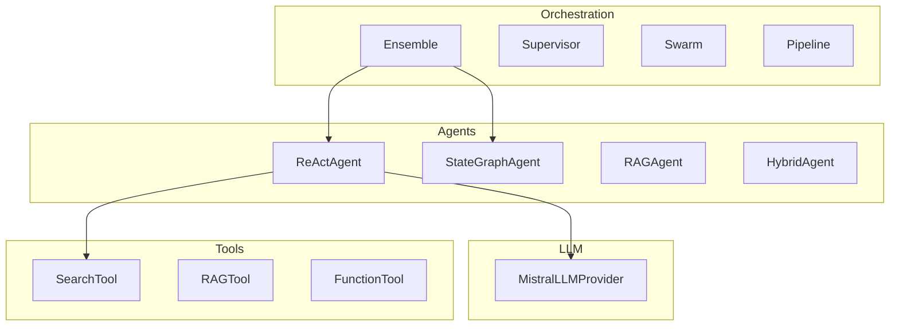

# AgentEnsemble Improvement Roadmap 2025

**Goal:** Make AgentEnsemble a production-ready, research-backed framework that surpasses existing solutions while remaining simple and developer-friendly.

Based on:
- Codebase analysis (agents, orchestration, tools, testing)
- Latest research (LangGraph, AutoGen, CrewAI, MCP)
- Production patterns (memory, streaming, human-in-the-loop)
- Industry best practices (2024–2025)

---

## Executive Summary

| Priority | Area | Impact | Effort |
|----------|------|--------|--------|
| **P0** | Fix critical bugs | High | Low |
| **P1** | Memory & session protocol | High | Medium |
| **P2** | Streaming & token-level UX | High | Medium |
| **P3** | Human-in-the-loop & checkpoints | High | Medium |
| **P4** | LLM routing for all agents | Medium | Medium |
| **P5** | Multi-agent debate pattern | Medium | Low |
| **P6** | Documentation & examples | Medium | Medium |
| **P7** | Observability & tests | Medium | Medium |

---

## 1. Architecture Improvements

### 1.1 Unified Agent Protocol

**Problem:** `StructuredAgent` does not inherit from `BaseAgent`; inconsistent APIs (`invoke` vs `run`, no `arun`).

**Solution:** Introduce a `AgentProtocol` that all agents implement:

```python
# agentensemble/agents/protocol.py
from typing import Protocol, runtime_checkable

@runtime_checkable
class AgentProtocol(Protocol):
    name: str
    
    def run(self, query: str, **kwargs) -> dict: ...
    async def arun(self, query: str, **kwargs) -> dict: ...
```

- Refactor `StructuredAgent` to extend `BaseAgent` or implement `AgentProtocol`
- Ensure `run()` and `arun()` are the canonical entry points

### 1.2 State Schema with Reducers (LangGraph-Style)

**Problem:** `AgentState` is flat; no merge semantics for concurrent updates.

**Solution:** Typed state with reducer functions (inspired by LangGraph):

```python
# agentensemble/state/schema.py
from typing import Annotated
from pydantic import BaseModel

def append_reducer(left: list, right: list) -> list:
    return left + right

class AgentState(BaseModel):
    messages: Annotated[list, append_reducer] = []
    tool_calls: Annotated[list, append_reducer] = []
    iteration_count: int = 0  # max reducer
    result: Optional[str] = None  # overwrite
```

**Benefits:** Deterministic merges, checkpoint-friendly, supports parallel node execution.

### 1.3 Runner Pattern (Central Entry Point)

**Problem:** Agents invoked directly; no unified config, hooks, or error handling.

**Solution:** `Runner` as the canonical entry point:

```python
# agentensemble/runner.py
class Runner:
    @staticmethod
    def run(agent: AgentProtocol, input: str | RunState, config: RunConfig | None = None) -> RunResult: ...
    
    @staticmethod
    async def arun(...) -> RunResult: ...
    
    @staticmethod
    def stream(...) -> RunResultStreaming: ...

class RunConfig:
    max_turns: int = 20
    session: Session | None = None
    hooks: RunHooks | None = None
    on_error: Callable | None = None
```

---

## 2. New Features from Recent Research

### 2.1 Memory & Session Protocol (Critical)

**Research:** Memoria (2024), Letta Conversations, VoltAgent, Redis Agent Memory.

**Impact:** 40–60% token savings, 2× fewer messages to resolve issues, 40% higher satisfaction.

**Implementation:**

```python
# agentensemble/memory/session.py
class Session(Protocol):
    session_id: str
    
    async def get_messages(self, limit: int | None = None) -> list[dict]: ...
    async def add_messages(self, messages: list[dict]) -> None: ...
    async def clear(self) -> None: ...

# Implementations
class InMemorySession: ...      # Dev/testing
class SQLiteSession: ...         # Production, no deps
class RedisSession: ...          # Distributed
```

**Compaction:** Summarize old messages to fit context window (Memoria-style).

### 2.2 Streaming (Token-Level UX)

**Research:** TTFT <500ms target; users perceive streaming as 40% faster; structured event protocol.

**Implementation:**

```python
# agentensemble/streaming.py
class StreamEvent(TypedDict):
    type: Literal["token", "tool_start", "tool_end", "done", "error"]
    data: Any

async def astream(agent: AgentProtocol, query: str) -> AsyncIterator[StreamEvent]:
    """Stream tokens and tool events for real-time UX."""
```

**Event types:** `token`, `tool_start`, `tool_end`, `reasoning` (for o1-style), `done`, `error`.

**Best practice:** Buffer DOM updates 50–100ms; show "Searching…" status; use SSE for transport.

### 2.3 Human-in-the-Loop & Checkpointing

**Research:** LangGraph `interrupt()`, dynamic vs static breakpoints, durable checkpointers.

**Implementation:**

```python
# agentensemble/checkpointing.py
class RunState(BaseModel):
    schema_version: int
    messages: list
    pending_approvals: list[ToolApproval]
    # Serializable for resume

# Usage: Pause before sensitive tool, resume with human decision
result = runner.run(agent, input, config=RunConfig(
    interrupt_before_tools=["execute_payment", "send_email"]
))
# Returns RunState when interrupted; resume with runner.run(input=run_state)
```

**Use cases:** Payment approval, SQL execution, file writes.

### 2.4 Multi-Agent Debate Pattern

**Research:** AutoGen multi-agent debate, CrewAI moderator/debater; effective for math/reasoning (GSM8K).

**Implementation:**

```python
# agentensemble/orchestration/debate.py
class DebateOrchestrator:
    """Solver agents propose → exchange feedback → aggregator votes."""
    
    def __init__(self, solvers: list[BaseAgent], aggregator: BaseAgent, rounds: int = 3): ...
    
    async def debate(self, problem: str) -> dict: ...
```

**Flow:** Aggregator distributes problem → solvers propose → exchange critiques → final vote.

### 2.5 Handoffs (Agent-to-Agent Delegation)

**Research:** OpenAI handoffs; triage → specialist routing.

**Implementation:**

```python
# agentensemble/handoffs.py
@dataclass
class Handoff:
    agent: BaseAgent
    description: str
    input_filter: Callable[[HandoffInputData], HandoffInputData] | None = None

# Triage agent hands off to billing/support/sales
agent = ReActAgent(handoffs=[Handoff(billing_agent, "Billing question"), ...])
```

### 2.6 MCP (Model Context Protocol) Integration

**Research:** MCP enables dynamic tool discovery; `tools/list`, `tools/call`; human approval recommended.

**Implementation:**

```python
# agentensemble/tools/mcp.py
class MCPToolAdapter:
    """Connect to MCP server for dynamic tool discovery."""
    
    async def connect(self, server_url: str) -> list[ToolSchema]: ...
    async def call(self, tool_name: str, arguments: dict) -> Any: ...
```

---

## 3. Production-Ready Design Patterns

### 3.1 Error Handling & Retries

```python
# agentensemble/runner.py
class RunConfig:
    max_retries: int = 2
    retry_on: tuple[type[Exception], ...] = (RateLimitError, TimeoutError)
    on_error: Callable[[RunError], RunResult | None] = None  # Custom handler
```

### 3.2 Guardrails (Input/Output/Tool)

```python
# agentensemble/guardrails.py
@input_guardrail
async def check_pii(ctx: RunContext) -> GuardrailResult: ...

@output_guardrail
async def check_harmful(output: str) -> GuardrailResult: ...

@tool_input_guardrail
async def validate_search_params(args: dict) -> GuardrailResult: ...
```

**Tripwire:** Halt execution when triggered.

### 3.3 Tool Approval Flow

```python
# For sensitive tools
@function_tool(needs_approval=True)
def execute_payment(amount: float, recipient: str) -> str: ...
```

**Flow:** Agent requests → Runner pauses → Human approves/rejects → Resume.

### 3.4 Observability

```python
# agentensemble/observability/
class RunHooks:
    on_llm_start: Callable[[...], None]
    on_llm_end: Callable[[...], None]
    on_tool_start: Callable[[...], None]
    on_tool_end: Callable[[...], None]
    on_handoff: Callable[[...], None]
```

**Export:** OpenTelemetry spans, LangSmith, token usage per turn.

---

## 4. Better Real-World Examples

### 4.1 Missing Examples (Add)

| Example | File | Agents | Tools | Purpose |
|---------|------|--------|-------|---------|
| StateGraph | `stategraph_example.py` | StateGraphAgent | Any | Custom nodes, routing |
| RAG-only | `rag_agent_example.py` | RAGAgent | RAGTool | Document Q&A |
| Swarm | `swarm_example.py` | SwarmOrchestrator | SearchTool | Parallel agents |
| Pipeline | `pipeline_example.py` | PipelineOrchestrator | Search, RAG | Sequential workflow |
| Tool Registry | `tool_registry_example.py` | ReActAgent | ToolRegistry | Dynamic tool management |
| Benchmark | `benchmark_example.py` | Any | Benchmark | Evaluation |
| Streaming | `streaming_example.py` | ReActAgent | SearchTool | Token-level streaming |
| Memory | `memory_example.py` | ReActAgent | Session | Multi-turn conversation |

### 4.2 Example Quality Improvements

- **End-to-end scripts:** Each example runnable with `PYTHONPATH=. python examples/xxx.py`
- **Real data:** Use actual queries (Nobel Prize, weather) not placeholders
- **Error handling:** Show try/except, fallbacks
- **Async:** Prefer `arun()` in examples; document sync vs async tradeoffs

### 4.3 Production Use Case Examples

```python
# examples/production/customer_support.py
# Multi-turn with memory, handoffs, and approval flow

# examples/production/research_pipeline.py
# Pipeline: Search → RAG → Validate → Summarize

# examples/production/debate_math.py
# Multi-agent debate for math problem solving
```

---

## 5. Documentation Improvements

### 5.1 Structure

```
docs/
├── index.md              # Overview
├── quickstart.md         # 5-minute setup
├── guides/
│   ├── agents.md         # Agent types, when to use
│   ├── tools.md          # Tool protocol, @function_tool
│   ├── orchestration.md  # Supervisor, Swarm, Pipeline, Debate
│   ├── memory.md         # Session, compaction
│   └── production.md     # Deployment, observability
├── api/
│   └── reference.md      # Auto-generated from docstrings
└── examples/
    └── index.md          # Example index with links
```

### 5.2 Code Samples

- **Copy-paste ready:** Each snippet includes imports and `if __name__ == "__main__"`
- **Environment:** Document required env vars (MISTRAL_API_KEY, SERPER_API_KEY)
- **Optional deps:** `pip install agentensemble[search]` etc.

### 5.3 Architecture Diagram

Add Mermaid diagram to README:



---

## 6. Critical Bug Fixes (P0)

- **`TOOL_STRATEGY_AVAILABLE`** in `examples/structured_output_example.py` line 82: Define or remove.
- **Swarm parallelism:** Use `asyncio.gather(agent.arun(...) for agent in agents)` instead of sequential `run()`.
- **README observability:** Remove or implement `observability/` package.

---

## 7. Implementation Priority

| Phase | Scope | Timeline |
|-------|-------|----------|
| **Phase 0** | Fix P0 bugs | 1 day |
| **Phase 1** | Memory (Session protocol, InMemorySQLite) | 1–2 weeks |
| **Phase 2** | Streaming (`astream`, StreamEvent) | 1–2 weeks |
| **Phase 3** | Human-in-the-loop (RunState, interrupt) | 2 weeks |
| **Phase 4** | LLM routing for HybridAgent, StateGraphAgent | 1–2 weeks |
| **Phase 5** | DebateOrchestrator | 1 week |
| **Phase 6** | Docs (MkDocs, guides, API ref) | 1–2 weeks |
| **Phase 7** | Tests (pytest, fixtures), Observability | 2 weeks |

---

## 8. Differentiation Summary

| Feature | AgentEnsemble (Target) | OpenAI SDK | LangGraph | CrewAI |
|---------|------------------------|------------|-----------|--------|
| Multi-provider | Mistral, OpenAI, Anthropic | OpenAI only | Any | Any |
| Memory | Session protocol | Session | Checkpointer | None |
| Streaming | Token + tool events | Yes | Yes | No |
| Human-in-loop | RunState, interrupt | Yes | Yes | No |
| Debate pattern | DebateOrchestrator | No | Manual | Yes |
| Ensemble patterns | Supervisor, Swarm, Pipeline | No | Manual | Yes |
| Simplicity | Low boilerplate | High | Medium | Medium |
| Open-source tools | Serper, DuckDuckGo | No | No | No |

---

## References

- [LangGraph Human-in-the-Loop](https://blog.langchain.com/making-it-easier-to-build-human-in-the-loop-agents-with-interrupt)
- [Memoria: Agentic Memory Framework](https://arxiv.org/html/2512.12686v1)
- [Streaming LLM UX Best Practices](https://getathenic.com/blog/streaming-llm-responses-real-time-ux)
- [AutoGen Multi-Agent Debate](https://microsoft.github.io/autogen/stable/user-guide/core-user-guide/design-patterns/multi-agent-debate.html)
- [Model Context Protocol (MCP)](https://modelcontextprotocol.io/specification/2024-11-05/index)
- [AgentEnsemble Improvement Plan](./IMPROVEMENT_PLAN.md)
